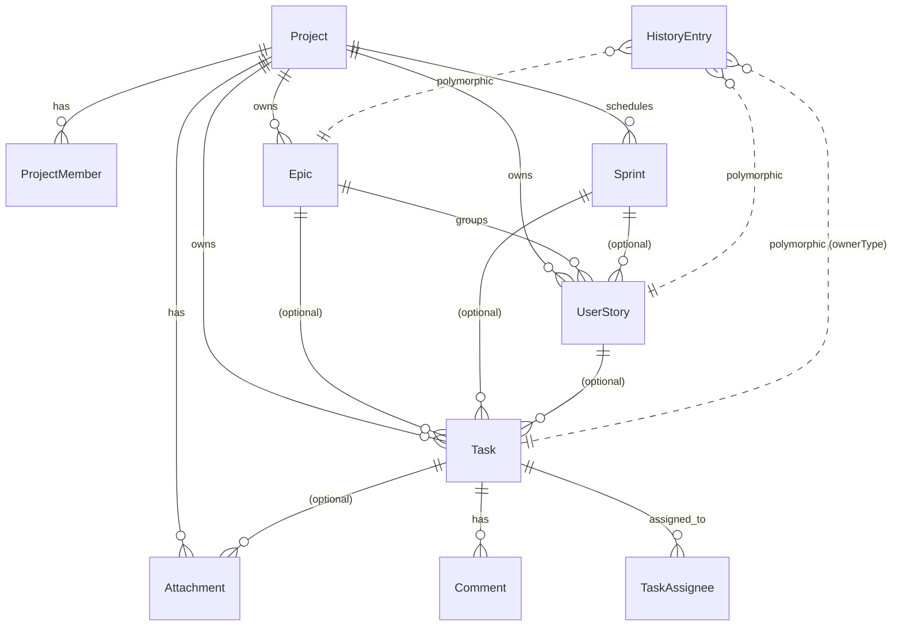

# Analyse du modèle de données agile actuel — project-forge (SprintForge)

**Mission** : phase 1 d'un travail de comparaison avec le modèle [iceScrum](https://www.icescrum.com/). Inventaire factuel du modèle existant, sans propositions.

**Périmètre** : domaine projet/agile du backend Fastify + MikroORM 7 + PostgreSQL — principalement `@libs/scrum-backend`.

**Méthode** : exploration du code, citation systématique de `fichier:ligne`. Pas de modification.

---

## 1. Inventaire des entités

Toutes les entités vivent dans `@libs/scrum-backend/src/<domaine>/` sous forme `defineEntity()` (MikroORM 7 — pas de classes, pas de méthodes domain). **Aucune relation MikroORM explicite** : tous les liens sont des `string` FK (UUIDs v4) sans `@ManyToOne` / `@OneToMany`. Indexes posés sur chaque FK.

Convention `CLAUDE.md` (`@libs/scrum-backend/CLAUDE.md`) : pas de relation cross-lib, populate via repository en P2.

### 1.1 ProjectEntity — `@libs/scrum-backend/src/project/project.entity.ts`

| Champ | Type | Notes |
|---|---|---|
| `id` | string (UUID) | PK |
| `name` | string | non-null |
| `description` | string | non-null |
| `status` | string | enum `planned \| active \| paused \| completed \| cancelled \| archived` (6 états) |
| `avatar` | string \| null | |
| `githubUrl` | string \| null | |
| `responsibleId` | string | indexed, FK users-backend |
| `createdById` | string | indexed, FK users-backend |
| `sprintDurationDays` | integer | default 14 |
| `defaultVelocityPoints` | integer | default 20 |
| `createdAt`, `updatedAt` | datetime | auto |

### 1.2 ProjectMemberEntity — `project/project-member.entity.ts`

| Champ | Type | Notes |
|---|---|---|
| `id` | string | PK |
| `projectId` | string | indexed |
| `userId` | string | indexed, FK users-backend |
| `role` | string | `owner \| member` |
| `joinedAt` | datetime | auto |

### 1.3 EpicEntity — `epic/epic.entity.ts`

| Champ | Type | Notes |
|---|---|---|
| `id` | string | PK |
| `title` | string | |
| `description` | string | |
| `projectId` | string | indexed |
| `status` | string | enum `todo \| in-progress \| done` |
| `createdAt`, `updatedAt` | datetime | auto |

⚠️ Pas de : `color`, `rank`, `type`, `value`, `notes`, `tags`, `uid` (vs. iceScrum `Feature`).

### 1.4 UserStoryEntity — `user-story/user-story.entity.ts`

| Champ | Type | Notes |
|---|---|---|
| `id` | string | PK |
| `title` | string | |
| `description` | string | |
| `projectId` | string | indexed |
| `epicId` | string \| null | indexed, FK Epic |
| `sprintId` | string \| null | indexed, FK Sprint |
| `status` | string | enum `todo \| in-progress \| done` |
| `points` | integer | non-null (Fibonacci côté validation : 1,2,3,5,8,13,21) |
| `priority` | integer | non-null |
| `createdAt`, `updatedAt` | datetime | auto |

⚠️ Pas de : `rank`, `value` (business value), `actor`, `dependsOn`/`dependences`, `acceptanceTests`, `tags`, `notes`, dates par transition d'état.

### 1.5 TaskEntity — `task/task.entity.ts`

| Champ | Type | Notes |
|---|---|---|
| `id` | string | PK |
| `number` | integer | indexed, unique per project, ≥ 1001 (généré applicativement, voir §3.7) |
| `title` | string | |
| `description` | string | |
| `status` | string | enum `todo \| in-progress \| testing \| uat \| done` (5 états — workflow QA) |
| `type` | string | enum 9 valeurs : `Frontend \| Backend \| Database \| UX \| Analyse \| DevOps \| API \| Security \| Testing` |
| `nature` | string | enum 10 valeurs : `Bug \| Feature \| Maintenance \| Hotfix \| Refacto \| Techdebt \| Spike \| Review \| Deployment \| Infra` |
| `priority` | string | enum `Basse \| Moyenne \| Haute \| Critique` |
| `points` | integer | non-null |
| `estimatedHours` | float \| null | |
| `projectId` | string | indexed |
| `userStoryId` | string \| null | indexed, FK UserStory |
| `epicId` | string \| null | indexed, FK Epic |
| `sprintId` | string \| null | indexed, FK Sprint |
| `createdById` | string | indexed, FK users-backend |
| `dueDate` | datetime \| null | |
| `createdAt`, `updatedAt` | datetime | auto |

✨ Workflow plus riche qu'iceScrum (5 états vs. 3) + classifications `type`/`nature`/`priority` très détaillées.
⚠️ Pas de : `responsible` (1 user dédié), `participants[]` (TaskAssignee s'en approche), `initial`/`estimation` (remaining time), `blocked`, `color`, `rank`, `notes`, `tags`.

### 1.6 TaskAssigneeEntity — `task/task-assignee.entity.ts`

Many-to-many implicite Task ↔ User (N assignés par task).

| Champ | Type | Notes |
|---|---|---|
| `id` | string | PK |
| `taskId` | string | indexed |
| `userId` | string | indexed, FK users-backend |
| `assignedAt` | datetime | auto |

Diffère de iceScrum : iceScrum a 1 `responsible` + N `participants[]`. Ici tout le monde est au même niveau.

### 1.7 CommentEntity — `task/comment.entity.ts`

| Champ | Type | Notes |
|---|---|---|
| `id` | string | PK |
| `taskId` | string | indexed |
| `userId` | string | indexed |
| `content` | string | |
| `type` | string | enum `comment \| status-change \| assignment \| github-push \| other` |
| `metadata` | JSON \| null | ex: `{ from, to }` pour status-change |
| `createdAt` | datetime | auto |

### 1.8 AttachmentEntity — `task/attachment.entity.ts`

| Champ | Type | Notes |
|---|---|---|
| `id` | string | PK |
| `taskId` | string \| null | indexed |
| `projectId` | string \| null | indexed |
| `name` | string | |
| `url` | string | |
| `mimeType` | string | |
| `sizeBytes` | integer | |
| `uploadedById` | string | indexed, FK users-backend |
| `createdAt` | datetime | auto |

✨ Polymorphe : peut être attaché à un Task OU un Project.

### 1.9 HistoryEntryEntity — `task/history-entry.entity.ts`

| Champ | Type | Notes |
|---|---|---|
| `id` | string | PK |
| `ownerType` | string | `task \| story \| epic \| ...` |
| `ownerId` | string | indexed |
| `type` | string | type d'événement |
| `description` | string | texte lisible |
| `userId` | string | indexed, FK users-backend |
| `metadata` | JSON \| null | |
| `createdAt` | datetime | auto |

⚠️ Entité présente mais **non câblée** : aucun hook MikroORM ne crée d'entrée automatiquement. L'audit trail repose actuellement sur les `Comment` de type `status-change`, créés manuellement par les routes.

### 1.10 SprintEntity — `sprint/sprint.entity.ts`

| Champ | Type | Notes |
|---|---|---|
| `id` | string | PK |
| `number` | integer | indexed, unique per project, auto |
| `name` | string | ex: `Sprint 001` |
| `goal` | string \| null | |
| `projectId` | string | indexed |
| `startDate` | datetime | |
| `endDate` | datetime | |
| `status` | string | enum `planned \| active \| completed` |
| `velocityPoints` | integer | default 0 — capacité prévue |
| `completedPoints` | integer | default 0 — points réellement complétés |
| `createdAt`, `updatedAt` | datetime | auto |

### 1.11 Entités absentes (vs. iceScrum)

- ❌ **Feature** : pas d'entité dédiée — `EpicEntity` joue ce rôle mais en plus pauvre
- ❌ **Release** : pas de container de sprints
- ❌ **AcceptanceTest** : pas d'entité — les ATs n'existent pas dans le modèle
- ❌ **Actor / Persona** : pas d'entité
- ❌ **Dependencies** entre stories (`dependsOn` / `dependences`)
- ❌ **Tags** transverses
- ❌ **Backlog** : pas d'entité — backlog implicite = `sprintId IS NULL` ou `sprint.status = 'planned'`

---

## 2. Cartographie des relations



**Cascade rules** : aucune (`cascade: [...]` et `orphanRemoval` absents partout). Suppression = RESTRICT côté PostgreSQL par défaut → la logique de cascade vit dans les routes/services.

---

## 3. Cycles de vie / workflows détectés

### 3.1 Project
**Pas de FSM**. Le `status` peut passer librement de n'importe quelle valeur à n'importe quelle autre via `PATCH /projects/:id` (`project/routes/update.route.ts:21-70`). Validation Zod uniquement sur la valeur, pas sur la transition.

### 3.2 Sprint — **seule vraie FSM du repo**

```
planned --(POST /sprints/:id/start)--> active --(POST /sprints/:id/stop)--> completed
                                                          ↓
                              [unfinished items → action obligatoire]
```

- **START** : `sprint/routes/actions.routes.ts:19-77` (`StartSprintRoute`)
  - Guard : `sprint.status === 'planned'` + **max 1 sprint actif par projet** (ligne 56)
- **STOP** : `sprint/routes/stop-sprint.route.ts:78-173` (`StopSprintRoute`)
  - Guard : `sprint.status === 'active'`
  - Si unfinished items > 0, body **doit** contenir `action ∈ { 'send-to-backlog', 'move-to-existing', 'move-to-next' }`
  - Helpers :
    - `recomputeCompletedPoints()` — `stop-sprint.helpers.ts:15-26` (basé sur stories.status === 'done')
    - `getUnfinishedItems()` — `stop-sprint.helpers.ts:28-35`
    - `transferUnfinished()` — `stop-sprint.helpers.ts:37-50`
- **CLOSE-PREVIEW** : `sprint/routes/close-preview.route.ts:17-92` — GET de preview retournant `{ unfinishedTasks, unfinishedStories, availableNextSprints }`

### 3.3 Epic / UserStory / Task
Transitions de `status` libres via `PATCH`. Aucune garde, aucun hook.

### 3.4 Hooks MikroORM
**Aucun** `@BeforeUpdate`, `@AfterCreate`, etc. sur aucune entité. Toute la logique vit dans les routes.

### 3.5 Création de Sprint (factory) — `sprint/utils/create-sprint.ts:50-78`
- `number` auto via `getNextSprintNumber(em, projectId)` (`sprint-numbering.ts`)
- `startDate` = `previousSprint.endDate + 1d` si un sprint précédent existe, sinon `today`
- `endDate` = `startDate + project.sprintDurationDays - 1` (default 14j)
- `name` auto = `Sprint ${number}` si non fourni
- `velocityPoints` auto = `project.defaultVelocityPoints` (default 20)

### 3.6 Numérotation Task — `utils/task-numbering.ts:5-15`
- Transaction `SELECT MAX(number) WHERE projectId → +1`
- Démarre à **1001**
- ⚠️ Risque de collision sous forte concurrence (pas de PG sequence dédiée)

---

## 4. Persistence

| Aspect | Valeur |
|---|---|
| **ORM** | MikroORM 7 (`@mikro-orm/core`, `@mikro-orm/postgresql`) |
| **DB** | PostgreSQL |
| **Config** | `@apps/backend/src/app/database.connection.ts:1-21` — fusionne `usersEntities + scrumEntities + timeTrackingEntities` |
| **Migrations** | ❌ **Aucune** — schéma régénéré via `pnpm schema:fresh` (drop + recreate from entity definitions) |
| **Seeders** | `@apps/backend/src/seeders/development.seeder.ts` (dev) + `e2e.seeder.ts` (E2E) |
| **Pattern entités** | `defineEntity()` + `InferEntity<typeof X>` pour le typage TS. Pas de classes, pas de getters/setters, pas de méthodes domain. |

**Implication majeure** : pas de versionning DB. Tout refacto de schéma nécessitera de mettre en place le système de migration MikroORM (`pnpm migration:create`) **pour la première fois**.

---

## 5. API REST exposée

Toutes sous `/api/v1/`. Routes définies dans `<domaine>/routes/*.route.ts`, montées via `mounters.ts:78-160+`.
Validation Zod via `fastify-type-provider-zod` v6 (réponse strictement typée sinon `FST_ERR_RESPONSE_SERIALIZATION`).
Sérialisation JSON:API (`makeJsonApiDocumentSchema`, `makeJsonApiError` depuis `@libs/backend-shared`).

| Ressource | Verbes principaux | Spécificités |
|---|---|---|
| **Projects** | CRUD | + `/stats`, `/members`, relationships `/epics`, `/user-stories`, `/sprints`, `/tasks` |
| **Epics** | CRUD | + `/user-stories`, `/tasks` |
| **UserStories** | CRUD | + `/tasks` |
| **Tasks** | CRUD | + `/comments`, `/attachments`, `/history`, `/assignees` |
| **Sprints** | CRUD | + **POST `/:id/start`**, **POST `/:id/stop`**, GET `/:id/close-preview`, POST `/:id/items`, GET `/:id/tasks` |
| **Search** | GET `/search?q=...` | cross-resource (projects, epics, stories, tasks) |
| **Dashboard** | GET `/dashboard` | stats globales + `TimeTrackingPort` |

`TimeTrackingPort` (`scrum-backend/src/dashboard/time-tracking.port.ts:1-4`) : interface de 2 méthodes (`sumHoursByUserAndSprint`, `deleteByProjectId`) implémentée par `@libs/time-tracking-backend` (add-on séparé). Tracke les **heures loggées**, pas le remaining time.

---

## 6. Tests sur le domaine

- **Unit** : 1 seul fichier — `tests/unit/entities.test.ts` (~50 lignes, round-trip shape sans DB).
- **Intégration** : 11 fichiers sous `tests/integration/` — routes HTTP avec DB réelle, isolation par transaction `em.begin / rollback` via `ScrumTestModule` (`tests/utils/setup-module.ts:37-60`).
  - `dashboard`, `epic`, `project`, `relationships`, `search`, `sprint-numbering`, `sprint`, `task`, `user-story`, etc.
- **Couverture FSM Sprint** : `sprint.route.test.ts` (533 lignes) — couvre START/STOP, mais à confirmer en détail si phase 2 validée.

---

## 7. Forces du modèle actuel (déjà supérieures à iceScrum)

1. ✨ **Workflow Task 5 états** (`todo / in-progress / testing / uat / done`) — meilleur pour équipes QA que les 3 états iceScrum.
2. ✨ **Task.nature** (10 valeurs) + **Task.type** (9 valeurs) — classification orthogonale très riche.
3. ✨ **Task.number** applicatif unique par projet — permet citation `#1042`.
4. ✨ **Polymorphic Attachments** (task OU project).
5. ✨ **GitHub integration** native dans `Comment.type` (`github-push`).
6. ✨ **Sprint Stop FSM stricte** avec preview + 3 actions de dispatch (`send-to-backlog` / `move-to-existing` / `move-to-next`).
7. ✨ **JSON:API + Zod end-to-end** — contrats stricts.
8. ✨ **TimeTracking** en add-on séparé (lib boundary respectée).

---

## 8. Ambiguïtés / décisions actées (cf. Q&R utilisateur)

| Question | Décision |
|---|---|
| Epic = Feature iceScrum ? | ✅ Oui — Epic à enrichir vers Feature |
| HistoryEntry à câbler ? | ✅ Oui — audit trail automatique via hooks |
| Release ? | ❌ Skip — sprints autonomes |
| AcceptanceTest ? | ✅ À créer |
| Remaining time sur Task ? | ✅ Option C — `estimatedHours` + heures loggées + nouveau `remainingHours` |
| Workflow Task 5 états ? | ✅ Conservé |
| Story dependencies ? | ✅ À ajouter |
| Backlogs multiples ? | ✅ Vues filtrées frontend, pas d'entité |

---

## 9. Fichiers clés (référence rapide)

| Domaine | Fichier |
|---|---|
| Entités | `@libs/scrum-backend/src/<domaine>/<entity>.entity.ts` |
| Enums Zod | `@libs/scrum-backend/src/types.ts:1-88` |
| Sprint FSM | `sprint/routes/actions.routes.ts`, `sprint/routes/stop-sprint.route.ts`, `sprint/routes/stop-sprint.helpers.ts`, `sprint/routes/close-preview.route.ts` |
| Sprint factory | `sprint/utils/create-sprint.ts:50-78` |
| Task numbering | `utils/task-numbering.ts:5-15` |
| Montage routes | `mounters.ts:78-160+` |
| Test harness | `tests/utils/setup-module.ts:37-60` |
| Config DB | `@apps/backend/src/app/database.connection.ts:1-21` |
| Seeder dev | `@apps/backend/src/seeders/development.seeder.ts` |
| TimeTrackingPort | `dashboard/time-tracking.port.ts:1-4` |
