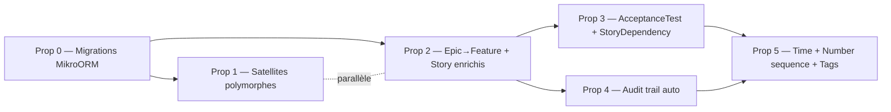

# Propositions de refacto — alignement project-forge ↔ iceScrum

**Mission** : phase 3. Produire des propositions concrètes, priorisées, justifiées, sans toucher au code. Pas de commit, pas de PR — uniquement spec.

**Décisions amont** (cf. fichier 02, §8) :
- Epic → Feature enrichi · Audit auto via hooks + `RequestContext` · ❌ Release · ✅ AcceptanceTest · Time model (C) `estimatedHours` + heures loggées + `remainingHours` · Task workflow 5 états conservé · Story dependencies · Backlogs = vues filtrées frontend · Story.status à 6 valeurs · Garder `priority` + ajouter `rank` · Task.number → PG sequence · Migrations en chantier 0 · Comment/Attachment polymorphiques unifiés avec routes hybrides
- Conventions TS : pas d'`any` implicite, union de littéraux ou `as const` plutôt qu'`enum` TS, branded types pour IDs (optionnel)
- ORM : MikroORM 7 (`defineEntity`)

---

## Vue d'ensemble & ordre d'exécution



**Cadence proposée** : P0 → P1 ∥ P2 → P3 ∥ P4 → P5.
**Effort total estimé** : ~3 sprints (2 dev) — P0 0.5j, P1 3-4j, P2 5-7j, P3 3-4j, P4 4-5j, P5 3-4j + tests.

---

## Prop 0 — Mise en place des migrations MikroORM (prérequis)

### Problème résolu
Aucune migration n'existe (cf. fichier 01, §4). Toute évolution de schéma actuelle se fait via `schema:fresh` (drop + recreate). En l'état, **aucune des propositions suivantes n'est applicable en production sans perte de données**.

### Solution proposée

1. Ajouter `@mikro-orm/migrations` au backend.
2. Configurer dans `@apps/backend/src/app/database.connection.ts` :
   ```typescript
   migrations: {
     path: './src/migrations',
     glob: '!(*.d).{js,ts}',
     transactional: true,
     allOrNothing: true,
     emit: 'ts',
   }
   ```
3. Générer une migration baseline qui matérialise l'état actuel des entités (équivalent du `schema:fresh` figé en SQL).
4. Ajouter scripts npm : `pnpm migration:create`, `pnpm migration:up`, `pnpm migration:down`, `pnpm migration:fresh` (preserve seeders behavior).
5. Documenter dans `CLAUDE.md` du repo + ADR dans `specs/done/`.
6. CI : workflow GitHub Actions qui exécute les migrations sur une PG fraîche, échoue si `schema:diff` détecte une drift vs entités.

### Impact
- **Fichiers** : `@apps/backend/package.json`, `@apps/backend/src/app/database.connection.ts`, **nouveau** `@apps/backend/src/migrations/Migration0001-baseline.ts`, `pnpm-lock.yaml`, **nouveau** `.github/workflows/check-migrations.yml` éventuel
- **Breaking** : non, ajout pur
- **Migration DB** : la baseline elle-même (pas de changement schéma)
- **Tests** : intégration → vérifier que `migration:up` sur une PG vide reproduit `schema:fresh`

### Effort
**S** (0.5j-1j).

### Priorité
**P0 — bloquant** pour toutes les autres propositions. À faire **avant tout autre changement de schéma**.

### Risques & rollback
- Risque : la baseline diverge des entités si une modif est faite en parallèle → CI `schema:diff` la détecte
- Rollback : trivial — revert le PR, retour `schema:fresh`

---

## Prop 1 — Unification polymorphique Comment + Attachment

### Problème résolu
- §2.7, §2.8, §2.9 — `Comment` n'est lié qu'à `Task` ; `Attachment` est polymorphique mais seulement `Task` OU `Project`.
- Besoin : commenter et attacher des documents à **n'importe quelle entité métier** (Epic, UserStory, Task, Project).
- Pattern `ownerType` + `ownerId` déjà éprouvé dans `HistoryEntry` → cohérence forte si on l'applique aux 3 satellites.

### Solution proposée

**Schémas cibles** (TS, `defineEntity` MikroORM 7 — exprimés en interface pour la lisibilité) :

```typescript
const SATELLITE_OWNER_TYPES = ['task', 'story', 'epic', 'project'] as const;
type SatelliteOwnerType = typeof SATELLITE_OWNER_TYPES[number];

interface CommentEntity {
  id: string;
  ownerType: SatelliteOwnerType;
  ownerId: string;           // indexed (composite index with ownerType)
  userId: string;            // indexed
  content: string;
  type: 'comment' | 'status-change' | 'assignment' | 'github-push' | 'other';
  metadata: Record<string, unknown> | null;
  createdAt: Date;
}

interface AttachmentEntity {
  id: string;
  ownerType: SatelliteOwnerType;
  ownerId: string;           // indexed (composite index with ownerType)
  name: string;
  url: string;
  mimeType: string;
  sizeBytes: number;
  uploadedById: string;      // indexed
  createdAt: Date;
}
```

**Index** : composite `(ownerType, ownerId)` sur chacune des deux tables — c'est le seul accès attendu en pratique.

**Routes** (pattern hybride validé Q6) :

| Verbe | Path | Action |
|---|---|---|
| GET | `/epics/:id/comments` | list nested |
| POST | `/epics/:id/comments` | create nested |
| GET | `/user-stories/:id/comments` | list nested |
| POST | `/user-stories/:id/comments` | create nested |
| GET | `/tasks/:id/comments` | list nested (**inchangé**) |
| POST | `/tasks/:id/comments` | create nested (**inchangé**) |
| GET | `/projects/:id/comments` | list nested |
| POST | `/projects/:id/comments` | create nested |
| GET | `/comments/:id` | flat read |
| DELETE | `/comments/:id` | flat delete |

(idem pour `/attachments`)

**Factorisation côté code** :

```typescript
// @libs/scrum-backend/src/comment/comment.routes-factory.ts
export function defineCommentsRoutes(parent: SatelliteOwnerType) {
  return [
    ListCommentsByOwnerRoute.for(parent),
    CreateCommentByOwnerRoute.for(parent),
  ];
}

// dans mounters.ts
for (const parent of SATELLITE_OWNER_TYPES) {
  for (const RouteCls of defineCommentsRoutes(parent)) {
    server.register(RouteCls);
  }
}
server.register(GetCommentRoute);     // GET /comments/:id
server.register(DeleteCommentRoute);  // DELETE /comments/:id
```

### Migration DB (génération nécessite Prop 0)

```sql
-- 1. Comment
ALTER TABLE comment ADD COLUMN owner_type VARCHAR(20);
ALTER TABLE comment ADD COLUMN owner_id UUID;
UPDATE comment SET owner_type = 'task', owner_id = task_id;
ALTER TABLE comment ALTER COLUMN owner_type SET NOT NULL;
ALTER TABLE comment ALTER COLUMN owner_id SET NOT NULL;
ALTER TABLE comment DROP COLUMN task_id;
CREATE INDEX idx_comment_owner ON comment(owner_type, owner_id);

-- 2. Attachment
ALTER TABLE attachment ADD COLUMN owner_type VARCHAR(20);
ALTER TABLE attachment ADD COLUMN owner_id UUID;
UPDATE attachment SET owner_type = 'task', owner_id = task_id WHERE task_id IS NOT NULL;
UPDATE attachment SET owner_type = 'project', owner_id = project_id WHERE project_id IS NOT NULL;
ALTER TABLE attachment ALTER COLUMN owner_type SET NOT NULL;
ALTER TABLE attachment ALTER COLUMN owner_id SET NOT NULL;
ALTER TABLE attachment DROP COLUMN task_id;
ALTER TABLE attachment DROP COLUMN project_id;
CREATE INDEX idx_attachment_owner ON attachment(owner_type, owner_id);
```

### Impact

- **Fichiers backend** :
  - `@libs/scrum-backend/src/task/comment.entity.ts`, `attachment.entity.ts` (refacto schema)
  - `@libs/scrum-backend/src/task/routes/comments.routes.ts`, `attachments.routes.ts` (refacto + factorisation)
  - **Nouveaux** `comment.routes-factory.ts`, `attachment.routes-factory.ts`
  - `@libs/scrum-backend/src/mounters.ts` (registration des nouvelles routes)
  - **Nouveaux** schémas Zod pour `CommentDocumentSchema`, `AttachmentDocumentSchema` (lecture/écriture)
  - Tests intégration : ajout couverture par owner type (`epic`, `story`, `project`)
- **Fichiers frontend** :
  - `@libs/backlog-front/src/services/comments.ts` (si existe, sinon créer) → polymorphique
  - `@libs/backlog-front/src/services/attachments.ts` idem
  - WarpDrive schemas dans `@apps/front/app/services/store.ts` : registrer `comments` et `attachments` types
- **Breaking changes** :
  - API : `POST /tasks/:id/comments` body actuel (`{ content, type, metadata }`) **inchangé** → no break front
  - Le `comment.taskId` n'existe plus dans la réponse — remplacé par `ownerType` + `ownerId` → **break réponse**
  - Solution mitigation : prévoir un transformateur dans `comment.serializer.ts` qui re-projette `taskId` à partir d'`ownerType==='task'` pendant 1-2 sprints
- **Migration DB** : oui (cf. SQL ci-dessus)

### Effort
**S-M** (3-4j incluant tests + migration front).

### Priorité
**Élevée** — débloque les commentaires/docs sur Epic et Story, demandés explicitement par l'utilisateur. Sémantique simple, refacto contenue, risque limité.

### Risques & rollback
- Risque : oubli d'un appel `.taskId` côté front → couvert par `tsc --noEmit` (champ supprimé du type) + serialiser de transition
- Risque : un comment lié à une `Task` supprimée laisse un `ownerId` orphelin → ajouter une cleanup function (cascade applicative, déjà absente partout)
- Rollback : revert migration up (script `migration:down` recrée `task_id` + repopule) + revert code

---

## Prop 2 — Enrichissement Epic→Feature et UserStory

### Problème résolu
- §2.1 — Epic actuel manque de `color`, `rank`, `value`, `type`, `notes`, `tags` (Q1)
- §2.2 + §3.1 — UserStory.status à 3 valeurs ne permet pas de distinguer Sandbox / Product Backlog / Sprint Backlog → vues filtrées frontend (Q8) impossibles ; manque aussi `rank`, `value`, `createdById`, `notes`

### Solution proposée

**Epic enrichi** :

```typescript
const FEATURE_TYPES = ['functional', 'architectural'] as const;
type FeatureType = typeof FEATURE_TYPES[number];

const FEATURE_STATUSES = ['todo', 'in-progress', 'done'] as const;
type FeatureStatus = typeof FEATURE_STATUSES[number];

interface EpicEntity {
  id: string;
  title: string;
  description: string;
  notes: string | null;             // NEW
  color: string;                    // NEW — hex, default '#6B7280' ; hérité par stories liées (UI)
  type: FeatureType;                // NEW — default 'functional'
  value: number | null;             // NEW — business value (0-100 conventionnel)
  rank: number;                     // NEW — ordre dans Features backlog ; unique per projectId
  status: FeatureStatus;
  projectId: string;
  createdById: string;              // NEW — cohérence avec Task
  createdAt: Date;
  updatedAt: Date;
}
```

**UserStory enrichi** :

```typescript
const STORY_STATUSES = [
  'suggested',     // Sandbox (state 1 iceScrum)
  'accepted',      // Product Backlog (state 2)
  'estimated',     // Product Backlog estimable (state 3)
  'planned',       // Sprint Backlog (state 4)
  'in-progress',   // Sprint actif (state 5)
  'done',          // Terminé (state 7) — InReview (6) absorbé en in-progress
] as const;
type StoryStatus = typeof STORY_STATUSES[number];

const STORY_PRIORITIES = ['Basse', 'Moyenne', 'Haute', 'Critique'] as const;
type StoryPriority = typeof STORY_PRIORITIES[number];

interface UserStoryEntity {
  id: string;
  title: string;
  description: string;
  notes: string | null;             // NEW
  projectId: string;
  epicId: string | null;
  sprintId: string | null;
  status: StoryStatus;              // CHANGED — 6 valeurs
  points: number | null;            // CHANGED — nullable (suggested/accepted ne sont pas encore estimés)
  priority: StoryPriority;          // CHANGED — string enum (était integer)
  rank: number;                     // NEW — ordre dans backlog/sprint ; unique per (projectId, sprintId)
  value: number | null;             // NEW — business value
  color: string | null;             // NEW — hérité d'epic.color par défaut
  createdById: string;              // NEW
  createdAt: Date;
  updatedAt: Date;
}
```

Note : `priority` passe d'`integer` à `string enum` pour aligner avec la convention `Task.priority`. Migration ad hoc :
- `priority=1 → 'Basse'`
- `priority=2 → 'Moyenne'`
- `priority=3 → 'Haute'`
- `priority>=4 → 'Critique'`

**Conséquences workflow** :
- Tout `UserStoryEntity` créé via `POST /user-stories` démarre en `status='suggested'`.
- La validation Zod sur la transition de status devient stricte (cf. tableau ci-dessous).
- L'ancien `status='todo'` est rétro-mappé en `'accepted'` lors de la migration (hypothèse pragmatique : si tu créais une story et la mettais en "todo", c'est que tu la considérais comme entrée dans le backlog).

**Transitions valides** (à coder dans une fonction `assertStoryTransition(from, to)`) :

```typescript
const VALID_STORY_TRANSITIONS: Record<StoryStatus, readonly StoryStatus[]> = {
  suggested:    ['accepted'],
  accepted:     ['suggested', 'estimated'],
  estimated:    ['accepted', 'planned'],
  planned:      ['estimated', 'in-progress'],
  'in-progress':['planned', 'done'],         // retour au backlog si sprint stoppé
  done:         [],                          // état terminal
} as const;
```

### Impact

- **Fichiers backend** :
  - `@libs/scrum-backend/src/epic/epic.entity.ts` (+6 colonnes)
  - `@libs/scrum-backend/src/user-story/user-story.entity.ts` (+7 colonnes / 2 changements)
  - `@libs/scrum-backend/src/types.ts` (enrichissement enums Zod)
  - Routes `epic/routes/*.route.ts`, `user-story/routes/*.route.ts` (validation Zod + serializers)
  - **Nouveau** `@libs/scrum-backend/src/user-story/transitions.ts` (helper `assertStoryTransition`)
  - `sprint/routes/stop-sprint.helpers.ts` : `getUnfinishedItems()` doit relire sur `status !== 'done'` (au lieu de `status='todo' | 'in-progress'`)
  - `dashboard/dashboard.route.ts` : agrégats par status à updater
- **Fichiers frontend** :
  - `@libs/backlog-front/src/schemas/epics.ts`, `user-stories.ts` (sync manuelle — cf. risque #2 §7 du gap)
  - `@libs/backlog-front/src/components/*` : tous les modaux Edit/Add (priority select, ajouts rank/value/color/notes)
  - **Filtres backlog** : nouvelle UX status pills (Sandbox / Backlog / Sprint Backlog / Done)
- **Breaking changes** :
  - API : `POST /user-stories` accepte désormais `priority: 'Basse' | ... | 'Critique'` (était integer)
  - API : `GET /user-stories` retourne `status: 'suggested' | ...` (6 valeurs au lieu de 3)
  - Le front doit être migré en même temps que le backend (ou un sprint plus tard avec un mapping transitoire)
- **Migration DB** :
  ```sql
  -- Epic
  ALTER TABLE epic ADD COLUMN notes TEXT;
  ALTER TABLE epic ADD COLUMN color VARCHAR(7) NOT NULL DEFAULT '#6B7280';
  ALTER TABLE epic ADD COLUMN type VARCHAR(20) NOT NULL DEFAULT 'functional';
  ALTER TABLE epic ADD COLUMN value INTEGER;
  ALTER TABLE epic ADD COLUMN rank INTEGER NOT NULL DEFAULT 0;
  ALTER TABLE epic ADD COLUMN created_by_id UUID;
  -- backfill created_by_id (heuristique : premier owner du projet)
  UPDATE epic SET created_by_id = (
    SELECT user_id FROM project_member
    WHERE project_id = epic.project_id AND role = 'owner' LIMIT 1
  );
  ALTER TABLE epic ALTER COLUMN created_by_id SET NOT NULL;
  -- backfill rank par projet (sur created_at)
  WITH ranked AS (SELECT id, ROW_NUMBER() OVER (PARTITION BY project_id ORDER BY created_at) AS rn FROM epic)
  UPDATE epic SET rank = ranked.rn FROM ranked WHERE epic.id = ranked.id;
  CREATE UNIQUE INDEX idx_epic_project_rank ON epic(project_id, rank);

  -- UserStory : pareil + status migration
  ALTER TABLE user_story ALTER COLUMN points DROP NOT NULL;
  ALTER TABLE user_story RENAME COLUMN priority TO priority_old;
  ALTER TABLE user_story ADD COLUMN priority VARCHAR(20);
  UPDATE user_story SET priority = CASE
    WHEN priority_old <= 1 THEN 'Basse'
    WHEN priority_old = 2 THEN 'Moyenne'
    WHEN priority_old = 3 THEN 'Haute'
    ELSE 'Critique' END;
  ALTER TABLE user_story ALTER COLUMN priority SET NOT NULL;
  ALTER TABLE user_story DROP COLUMN priority_old;
  -- migration status
  UPDATE user_story SET status = 'accepted' WHERE status = 'todo';
  -- + ajout colonnes rank/value/color/notes/created_by_id + backfills équivalents
  CREATE UNIQUE INDEX idx_story_proj_sprint_rank ON user_story(project_id, COALESCE(sprint_id, ''), rank);
  ```

### Effort
**M-L** (5-7j incluant migrations data + tests intégration + sync front).

### Priorité
**Très élevée** — débloque les vues filtrées frontend (objectif principal) et le ranking des backlogs. C'est le cœur du refacto.

### Risques & rollback
- Risque : `unique(projectId, rank)` peut casser sur reorder concurrent → utiliser une stratégie de re-ranking par delta (`rank = previous + (next-previous)/2`) ou batch reorder transactionnel
- Risque : front non synchronisé → on déploie le backend en mode "tolérant" pendant 1 sprint (Zod accepte int OU string pour priority, retourne le nouveau format mais accepte l'ancien)
- Risque : `Sprint.stop` se base sur statut → mettre à jour `getUnfinishedItems` **en même temps que** la migration status
- Rollback : `migration:down` restaure colonnes anciennes + remap inverse status/priority

---

## Prop 3 — AcceptanceTest + StoryDependency

### Problème résolu
- §2.4 — `AcceptanceTest` absent (Q4 ✅ à créer)
- §2.5 — Pas de `dependsOn` / `dependences` entre stories (Q7 ✅ à créer)

### Solution proposée

**AcceptanceTest** :

```typescript
const AT_STATES = ['to-check', 'failed', 'success'] as const;
type AcceptanceTestState = typeof AT_STATES[number];

interface AcceptanceTestEntity {
  id: string;
  userStoryId: string;         // indexed
  name: string;
  description: string;
  state: AcceptanceTestState;
  rank: number;                // ordre d'affichage ; unique per userStoryId
  createdById: string;
  createdAt: Date;
  updatedAt: Date;
}
```

**Routes** :
- `GET /user-stories/:id/acceptance-tests` (list)
- `POST /user-stories/:id/acceptance-tests` (create)
- `PATCH /acceptance-tests/:id` (update name/description/state/rank)
- `DELETE /acceptance-tests/:id`

**Agrégat `testState` sur Story** (calculé à la lecture, pas stocké) :
```typescript
function aggregateTestState(ats: AcceptanceTestEntity[]): 'none' | 'all-success' | 'has-failed' | 'pending' {
  if (ats.length === 0) return 'none';
  if (ats.some(at => at.state === 'failed')) return 'has-failed';
  if (ats.every(at => at.state === 'success')) return 'all-success';
  return 'pending';
}
```

Exposé dans le serializer Story sous le champ `meta.testState` (JSON:API meta) — non persisté.

**StoryDependency** :

```typescript
const STORY_DEP_TYPES = ['blocks', 'relates-to'] as const;
type StoryDependencyType = typeof STORY_DEP_TYPES[number];

interface StoryDependencyEntity {
  id: string;
  fromStoryId: string;         // indexed
  toStoryId: string;           // indexed
  type: StoryDependencyType;   // default 'blocks'
  createdAt: Date;
}
```

**Garde-fous applicatifs** (à coder dans `StoryDependencyService.create`) :
1. `fromStoryId !== toStoryId` (no self-dep)
2. `fromStory.projectId === toStory.projectId` (no cross-project)
3. Détection de cycle (DFS sur les deps existantes du type `'blocks'` avant insertion)
4. Unique `(fromStoryId, toStoryId)` (pas de doublon)

**Routes** :
- `GET /user-stories/:id/dependencies` (toutes deps liées — outgoing + incoming dans le payload)
- `POST /user-stories/:id/dependencies` body `{ toStoryId, type }`
- `DELETE /story-dependencies/:id`

### Impact

- **Fichiers backend** :
  - **Nouveau** `@libs/scrum-backend/src/acceptance-test/` (entity + 4 routes + serializer + tests)
  - **Nouveau** `@libs/scrum-backend/src/story-dependency/` (entity + 3 routes + service avec cycle detection + tests)
  - `user-story/user-story.serializer.ts` : ajout `meta.testState` et `meta.dependencies`
  - `mounters.ts` : register
- **Fichiers frontend** :
  - **Nouvelle** lib `@libs/backlog-front/src/components/acceptance-test-list.gts` (et modaux)
  - **Nouvelle** UI pour `dependencies` dans `edit-user-story-modal.gts`
- **Breaking** : non, ajout pur
- **Migration DB** :
  ```sql
  CREATE TABLE acceptance_test (
    id UUID PRIMARY KEY,
    user_story_id UUID NOT NULL,
    name VARCHAR(255) NOT NULL,
    description TEXT NOT NULL,
    state VARCHAR(20) NOT NULL,
    rank INTEGER NOT NULL,
    created_by_id UUID NOT NULL,
    created_at TIMESTAMPTZ NOT NULL,
    updated_at TIMESTAMPTZ NOT NULL
  );
  CREATE INDEX idx_at_story ON acceptance_test(user_story_id);
  CREATE UNIQUE INDEX idx_at_story_rank ON acceptance_test(user_story_id, rank);

  CREATE TABLE story_dependency (
    id UUID PRIMARY KEY,
    from_story_id UUID NOT NULL,
    to_story_id UUID NOT NULL,
    type VARCHAR(20) NOT NULL,
    created_at TIMESTAMPTZ NOT NULL
  );
  CREATE INDEX idx_dep_from ON story_dependency(from_story_id);
  CREATE INDEX idx_dep_to ON story_dependency(to_story_id);
  CREATE UNIQUE INDEX idx_dep_unique ON story_dependency(from_story_id, to_story_id);
  ```

### Effort
**M** (3-4j) — schéma simple, mais cycle detection + UI list/edit acceptance tests prennent du temps.

### Priorité
**Élevée** mais après Prop 2 (dépend de Story.id stables). Peut commencer dès Prop 2 mergée.

### Risques & rollback
- Risque : cycle detection coûteuse sur des graphes de deps profonds → limiter à 1000 nœuds explorés par check (probablement aucun projet n'aura plus)
- Risque : suppression d'une Story laisse des `story_dependency` orphelins → cascade applicative ou FK avec `ON DELETE CASCADE` (recommandé)
- Rollback : `DROP TABLE` (aucune donnée existante)

---

## Prop 4 — Audit trail automatique via hooks MikroORM

### Problème résolu
- §2.6 — `HistoryEntry` existe mais n'est pas câblé (Q2 ✅ activer)
- Pas de traçabilité des transitions de status hors `Comment.type='status-change'` créé manuellement

### Solution proposée

**Mécanisme** : `@OnFlush` / `@AfterFlush` MikroORM via un EventSubscriber global qui :
1. Inspecte les ChangeSets de chaque flush
2. Pour chaque entité instrumentée (`Epic`, `UserStory`, `Task`, `Sprint`), si le `status` a changé, crée un `HistoryEntry`
3. Récupère le `userId` depuis le `RequestContext` MikroORM

**Code cible** :

```typescript
// @libs/scrum-backend/src/audit/audit.subscriber.ts
import { EventSubscriber, FlushEventArgs, RequestContext } from '@mikro-orm/core';

const AUDITED_ENTITIES = new Map<string, string>([
  ['EpicEntity', 'epic'],
  ['UserStoryEntity', 'story'],
  ['TaskEntity', 'task'],
  ['SprintEntity', 'sprint'],
]);

export class AuditSubscriber implements EventSubscriber {
  async onFlush(args: FlushEventArgs): Promise<void> {
    const em = args.em;
    const ctx = RequestContext.currentRequestContext();
    const userId = ctx?.userId;            // injecté par middleware auth (cf. ci-dessous)
    if (!userId) return;                   // pas d'audit pour les changements hors requête (seeds, jobs)

    for (const changeSet of em.getUnitOfWork().getChangeSets()) {
      const entityName = changeSet.entity.constructor.name;
      const ownerType = AUDITED_ENTITIES.get(entityName);
      if (!ownerType) continue;
      if (!changeSet.payload.status) continue;  // status non modifié

      em.create(HistoryEntryEntity, {
        id: randomUUID(),
        ownerType,
        ownerId: changeSet.entity.id,
        type: 'status-change',
        description: `Status ${changeSet.originalEntity?.status ?? '∅'} → ${changeSet.payload.status}`,
        userId,
        metadata: {
          from: changeSet.originalEntity?.status,
          to: changeSet.payload.status,
        },
        createdAt: new Date(),
      });
    }
  }
}
```

**Injection du `userId` dans `RequestContext`** :

```typescript
// @libs/scrum-backend/src/auth/audit-context.middleware.ts (ou hook Fastify)
fastify.addHook('onRequest', async (req) => {
  if (req.user) {                                  // déjà rempli par auth middleware
    RequestContext.create(orm.em, () => {
      RequestContext.currentRequestContext()!.userId = req.user.id;
    });
  }
});
```

Note importante : MikroORM 7 `RequestContext` est un AsyncLocalStorage sous le capot — c'est exactement ce qu'on veut. Si tu utilises déjà `RequestContext.create()` dans le bootstrap (à vérifier dans `@apps/backend/src/app/server-context.ts`), il suffit d'attacher la propriété `userId` au contexte.

**Étendre l'audit hors status** (optionnel, phase ultérieure) : facile une fois le pattern en place — ajouter d'autres champs surveillés dans `AUDITED_ENTITIES` avec une liste de fields par entité.

### Impact

- **Fichiers backend** :
  - **Nouveau** `@libs/scrum-backend/src/audit/audit.subscriber.ts`
  - `@apps/backend/src/app/database.connection.ts` : `subscribers: [AuditSubscriber]`
  - `@apps/backend/src/app/server-context.ts` ou middleware Fastify : injecter `userId` dans `RequestContext`
  - Tests intégration : créer/update entités, vérifier `HistoryEntry` créées
- **Fichiers frontend** :
  - Nouvelle UI "Historique" dans `task-detail-modal`, `edit-user-story-modal`, `edit-epic-modal`
  - Réutilise probablement l'existant `GET /tasks/:id/history` (à étendre `/user-stories/:id/history`, `/epics/:id/history`)
- **Breaking** : non, ajout pur. Les Comment.type='status-change' existants peuvent rester (legacy) ou être migrés vers HistoryEntry dans la migration.
- **Migration DB** : aucune (table `history_entry` existe déjà)

### Effort
**M** (4-5j) — la magie est dans le détail (race conditions sur `RequestContext`, gestion des seeders/jobs sans userId, tests d'intégration sur le subscriber).

### Priorité
**Importante** — apporte beaucoup de valeur produit (traçabilité) sans bloquer rien. À faire après Prop 2 (sinon on audit un schéma qui va changer).

### Risques & rollback
- Risque : `RequestContext` non disponible dans un hook async → vérifier en local
- Risque : les seeders/jobs sans userId génèrent des warnings (handler doit gracefully skip — `return` au lieu de `throw`)
- Risque : volume `history_entry` grossit vite → prévoir un index sur `created_at` et une politique de purge à 6 mois (config)
- Rollback : retirer `AuditSubscriber` de la config MikroORM ; les `history_entry` existants restent (lecture seule OK)

---

## Prop 5 — Time model + Task.number sequence + Tags (groupé)

### Problème résolu
- §2.3 — `Task.remainingHours` manquant (Q5/C ✅)
- §7 risque 5 — `Task.number` MAX+1 non sérialisé (Q4 dans le scope)
- §6 🟡 — Tags transverses (Epic/Story/Task) — nice-to-have

### Solution proposée

**5a — Time model sur Task** :

```typescript
interface TaskEntity {
  // ... champs existants
  estimatedHours: number | null;     // INCHANGÉ — estimation initiale, figée
  remainingHours: number | null;     // NEW — remaining time, ré-évalué par l'équipe
}
```

À la création : `remainingHours = estimatedHours` (initialement).
À la transition vers `done` : `remainingHours = 0` (auto via hook MikroORM).

**Service burndown** :

```typescript
// @libs/scrum-backend/src/sprint/services/burndown.service.ts
async function getBurndown(sprintId: string): Promise<BurndownData> {
  // 1. Lire snapshot quotidien (table sprint_burndown_snapshot — voir §migration)
  // 2. Calculer total remainingHours par jour entre startDate et endDate
  // 3. Calculer ideal line (linéaire de total initial à 0)
  // 4. Retourner { actual: [{ day, remaining }], ideal: [...] }
}
```

Snapshot quotidien via cron (1 fois par jour à minuit, somme `remainingHours` pour le sprint actif) :

```typescript
interface SprintBurndownSnapshotEntity {
  id: string;
  sprintId: string;
  snapshotDate: Date;
  remainingHoursTotal: number;
  remainingPointsTotal: number;    // bonus : burndown points en parallèle
  taskCount: number;
}
```

**5b — Task.number → PG sequence per project** :

PostgreSQL n'a pas de sequence "per partition" native, mais on peut :
- Option 1 : table `project_task_counter (project_id PK, next_number INTEGER)` avec `SELECT FOR UPDATE` → simple, sérialisé, contrôle total
- Option 2 : sequence globale `task_global_seq` + colonne `display_number` = `next_seq()` lors de la création, sans garantie de continuité par projet → simple mais perd "Task #1042" linéaire
- Option 3 : advisory lock PG (`pg_advisory_xact_lock(hashtext(projectId))`) autour du SELECT MAX(number) + 1 → pas de table en plus, latence pg lock négligeable

**Recommandation** : **Option 1** (table compteur) — explicite, debuggable, performant. Migration triviale.

```sql
CREATE TABLE project_task_counter (
  project_id UUID PRIMARY KEY REFERENCES project(id) ON DELETE CASCADE,
  next_number INTEGER NOT NULL DEFAULT 1001
);
-- Backfill
INSERT INTO project_task_counter (project_id, next_number)
SELECT id, COALESCE((SELECT MAX(number) FROM task WHERE project_id = project.id), 1000) + 1
FROM project;
```

```typescript
// task-numbering.ts (refactoré)
export async function getNextTaskNumber(em: EntityManager, projectId: string): Promise<number> {
  const result = await em.execute(
    'UPDATE project_task_counter SET next_number = next_number + 1 WHERE project_id = ? RETURNING next_number - 1 AS allocated',
    [projectId],
  );
  return result[0].allocated;
}
```

L'`UPDATE ... RETURNING` est atomique par ligne en PG ; pas de race condition.

**5c — Tags transverses** (optionnel selon ton appétit) :

Deux options :
- **Tag léger** : colonne `tags: string[]` (PostgreSQL `TEXT[]`) sur chaque entité (Epic, UserStory, Task) → simple, indexable via GIN
- **Tag entité** : table `tag` + table de jointure `tag_link(tagId, ownerType, ownerId)` → plus lourd mais permet renommage centralisé et autocomplete

**Recommandation** : option **Tag léger** (TEXT[]) — suffisant pour notre échelle, pas de table d'admin à maintenir.

```typescript
interface EpicEntity { /* ... */ tags: string[]; }
interface UserStoryEntity { /* ... */ tags: string[]; }
interface TaskEntity { /* ... */ tags: string[]; }
```

```sql
ALTER TABLE epic ADD COLUMN tags TEXT[] NOT NULL DEFAULT '{}';
ALTER TABLE user_story ADD COLUMN tags TEXT[] NOT NULL DEFAULT '{}';
ALTER TABLE task ADD COLUMN tags TEXT[] NOT NULL DEFAULT '{}';
CREATE INDEX idx_epic_tags ON epic USING GIN(tags);
CREATE INDEX idx_story_tags ON user_story USING GIN(tags);
CREATE INDEX idx_task_tags ON task USING GIN(tags);
```

### Impact

- **Fichiers backend** :
  - `task/task.entity.ts` : +`remainingHours`
  - **Nouveau** `task/utils/task-numbering.ts` (refacto)
  - **Nouvelle entité** `sprint/sprint-burndown-snapshot.entity.ts` + service + cron
  - **Nouvelle entité** `project/project-task-counter.entity.ts`
  - `task/routes/update.route.ts` : hook `onUpdate` set `remainingHours = 0` quand `status='done'`
  - `epic/`, `user-story/`, `task/` : ajout `tags`
- **Fichiers frontend** :
  - UI burndown chart dans dashboard sprint
  - Input remainingHours dans task-detail-modal
  - UI tags (chip input) dans modaux Edit
- **Breaking** : non
- **Migration DB** : (cf. SQL ci-dessus)

### Effort
**M** (3-4j) — chacun des 3 sub-items est modeste mais le total fait du volume.

### Priorité
**Moyenne** — apport produit certain (burndown demandé, robustesse Task.number) mais aucun de ces items ne débloque le reste. À faire en dernier.

### Risques & rollback
- Risque burndown : snapshot manqué un jour → trou dans le chart → fallback "ligne interpolée" côté front
- Risque tags : pollution avec des typos → autocomplete frontend basé sur `DISTINCT unnest(tags)` côté API
- Risque Task.number : si on backfille mal le compteur, dérive immédiate → tests intégration obligatoires
- Rollback : 5a/5c trivial (drop column) ; 5b plus délicat car des tasks ont déjà été créées entre-temps → rollback nécessite la sauvegarde du compteur

---

## Récap des dépendances entre propositions

```
P0 (Migrations)
  ├── P1 (Polymorphic Comment + Attachment)        — peut démarrer dès P0 mergée
  ├── P2 (Epic + Story enrich)                     — peut démarrer dès P0 mergée
  │     ├── P3 (AcceptanceTest + StoryDependency)  — dépend de P2 (Story.id stables + status)
  │     └── P4 (Audit trail)                       — dépend de P2 (audit le bon schéma)
  └── P5 (Time + Number sequence + Tags)           — dépend de P3 OU P4 mergée (cycle de sprint stabilisé)
```

**Parallèle possible** : P1 et P2 peuvent être faits en parallèle par deux développeurs (bounded contexts distincts : satellites vs. core domain).

---

## Ce que je déconseille de reprendre d'iceScrum

| Concept iceScrum | Raison de l'écarter |
|---|---|
| **Release** | Décidé Q3 — sprints autonomes |
| **Story.type** (user / defect / technical) | `Task.nature` couvre déjà la classification (Bug / Refacto / Feature / etc.) ; ajouter `Story.type` doublonne |
| **Tasks récurrents / urgents** (`type=10/11`) | Plages couvertes par `Task.nature` (Maintenance / Hotfix) — pas besoin d'un discriminateur supplémentaire |
| **Actor / Persona** entité | Pas demandé, complexité disproportionnée pour notre échelle |
| **Story.affectVersion** | Pas de notion de version produit dans SprintForge |
| **Story.origin** (cross-project copy) | Cas d'usage non identifié |
| **Discriminateurs numériques** (`state: 1|2|3|4...`) | TS conseille union de littéraux string — plus lisible, mieux serializable JSON, mieux searchable en SQL |
| **Epic Story temporaire** | Pattern de split rare ; on l'absorbe par création directe des stories filles avec un parent commun via `tag` |
| **Burndown sur points uniquement** | On peut faire burndown points ET burndown remaining-hours en parallèle (snapshot a les deux colonnes — peu de coût additionnel) |

---

## Conventions transverses appliquées (rappel)

1. **Types** : `as const` + `typeof X[number]` pour les enums (pas d'`enum` TS).
2. **IDs** : `string` non-branded actuellement — laisser tel quel pour ce refacto, branded types peuvent venir dans un chantier séparé.
3. **Validation** : Zod côté API, sync manuelle des types côté frontend (pas de génération auto — risque connu, hors scope).
4. **JSON:API** : tous les nouveaux endpoints respectent le format `{ data: { type, id, attributes, relationships, meta } }`.
5. **Tests** : chaque entité nouvelle / refactorée doit avoir un test d'intégration de bout en bout (route → DB → réponse) + tests unitaires sur les transitions de status.

---

## Critères de succès globaux

À vérifier avant de marquer le refacto comme "done" :

1. ✅ `pnpm migration:up` sur une PG vide reproduit `pnpm schema:fresh` (zéro drift)
2. ✅ Tous les anciens tests d'intégration passent (régression contrôlée)
3. ✅ Nouvelle UI Sandbox/Backlog/Sprint Backlog visible et fonctionnelle (smoke test manuel)
4. ✅ Création d'un commentaire sur Epic et Story fonctionne via UI
5. ✅ Upload d'un fichier sur Epic et Story fonctionne via UI
6. ✅ Création d'un AcceptanceTest sur une Story + transition states fonctionne
7. ✅ Création d'une StoryDependency + détection cycle marche (test E2E)
8. ✅ Modifier le status d'une Task crée automatiquement un `HistoryEntry` (test intégration)
9. ✅ Burndown chart visible sur un sprint actif (smoke test)
10. ✅ Création de 50 tasks concurrentes sur le même projet → numéros uniques contigus (test stress)
11. ✅ `pnpm turbo lint` 0 erreur · `pnpm turbo test` 100% pass
