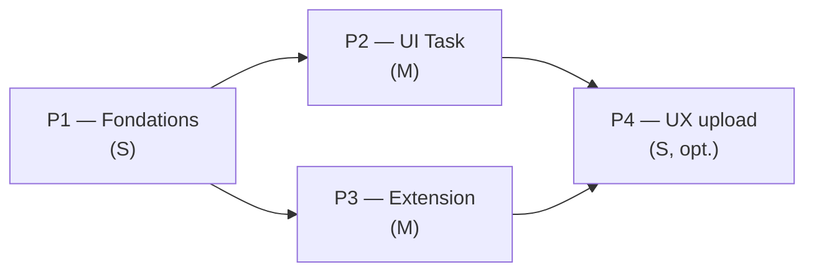

# Refacto iceScrum — UI Comments & Attachments

**Mission** : combler la dette UI Comments/Attachments laissée par le refacto backend P0-P5 (cf. `specs/done/icescrum-refacto-03-proposals.md`). Aucun changement backend nécessaire — toutes les routes polymorphes sont déjà exposées.

**Effort total estimé** : ~5-9j.

---

## Problème résolu

Le refacto backend P0-P5 a polymorphisé les `Comment` et `Attachment` (`ownerType` + `ownerId` → `task | epic | user-story | project`), mais l'UI Ember n'a jamais été mise à jour :

- `task-detail-modal.gts` : onglet "Comments" affiche les commentaires en **read-only** (pas de form d'ajout/edit/delete) ; section "Attachments" 100% placeholder + bouton `disabled`.
- Aucune UI sur Epic, UserStory, Project.
- `@libs/backlog-front/src/services/tasks.ts:142` utilise un `fetch()` brut sans Bearer → **401 silencieux** en production (viole la règle CLAUDE.md du repo).
- Aucun schema WarpDrive enregistré pour `comments` / `attachments` dans `@apps/front/app/services/store.ts`.

---

## P1 — Fondations (S, 0.5-1j)

### Solution proposée

1. **Schemas WarpDrive** : enregistrer `comments` et `attachments` dans `@apps/front/app/services/store.ts` (sinon `Missing Resource Type` silencieux).
2. **Fix 401 silencieux** : remplacer le `fetch()` brut dans `@libs/backlog-front/src/services/tasks.ts:loadComments` par `store.request()` ou `authFetch` de `@libs/shared-front/src/utils/auth-fetch.ts`.
3. **Service polymorphe** : créer un service `comments` (dans `@libs/shared-front` ou nouveau `@libs/social-front` — préférence `shared-front` pour éviter une lib trop fine) exposant :
   - `loadComments(ownerType: OwnerType, ownerId: string)`
   - `createComment(ownerType, ownerId, { content, type? })`
   - `updateComment(commentId, { content })`
   - `deleteComment(commentId)`
4. **Service attachments** équivalent :
   - `loadAttachments(ownerType, ownerId)`
   - `uploadAttachment(ownerType, ownerId, file: File)` (multipart)
   - `deleteAttachment(attachmentId)`
5. **Types stricts** : `type OwnerType = 'task' | 'epic' | 'user-story' | 'project'`.
6. **MSW handlers** : mettre à jour `@libs/backlog-front/src/http-mocks/backlog.ts` pour matcher `/api/v1/{tasks|epics|user-stories|projects}/:id/comments` + `/api/v1/comments/:id`.

### Impact

- **Fichiers** : `@apps/front/app/services/store.ts`, `@libs/backlog-front/src/services/tasks.ts`, **nouveau** `@libs/shared-front/src/services/comments.ts` + `attachments.ts`, **nouveau** `@libs/shared-front/src/schemas/comment.ts` + `attachment.ts`, `@libs/backlog-front/src/http-mocks/backlog.ts`.
- **Breaking** : non (routes backend déjà polymorphes).
- **Migration DB** : aucune.
- **Tests** : unit Vitest sur les services + MSW intégration.

### Critères d'acceptation

- [ ] Aucun `fetch()` brut sur `/api/v1/*` dans `@libs/backlog-front/src/services/`.
- [ ] `store.request({ url: '/api/v1/tasks/X/comments' })` retourne la liste authentifiée.
- [ ] `data-test-*` selectors présents sur les nouveaux composants.

---

## P2 — UI Task CRUD (M, 2-3j)

### Solution proposée

1. **Onglet Comments** du `task-detail-modal.gts` → CRUD complet :
   - Form d'ajout (textarea + bouton "Poster").
   - Edit inline (icône stylo) sur ses propres comments.
   - Delete (icône poubelle) sur ses propres comments (ou si project owner).
   - Affichage avatar/nom user résolu (pas juste `authorId`) — via `users` service.
2. **Section Attachments** dans onglet Details :
   - Liste fichiers : nom + taille humaine + bouton download + bouton delete.
   - Bouton upload activé : `<input type="file">` → POST multipart.
   - Drag-and-drop reporté en P4.
3. **Traductions** FR/EN dans `@apps/front/translations/backlog/task-detail.yml`.

### Impact

- **Fichiers** : `@libs/backlog-front/src/components/task-detail-modal.gts`, `@apps/front/translations/backlog/task-detail.yml`.
- **Breaking** : non.
- **Tests** : intégration Ember (rendering + `await fillIn` + `click`).

### Critères d'acceptation

- [ ] L'utilisateur peut poster, éditer (ses propres), supprimer un comment sur une Task.
- [ ] L'utilisateur peut uploader, télécharger, supprimer un attachment.
- [ ] L'avatar et le nom de l'auteur sont affichés.
- [ ] Le bouton "Edit task" reste `disabled` (hors scope).

---

## P3 — Extension Epic / UserStory / Project (M, 2-3j)

### Solution proposée

1. **Factoriser AVANT duplication** : créer dans `@libs/shared-front/src/components/` :
   - `<CommentThread @ownerType @ownerId @canModerate />`
   - `<AttachmentList @ownerType @ownerId @canModerate />`
2. **Intégrer** dans :
   - `@libs/backlog-front/src/components/edit-epic-modal.gts` (nouvel onglet "Discussion" ou section pliable).
   - `@libs/backlog-front/src/components/edit-user-story-modal.gts` (idem).
   - `@libs/projects-front/src/components/project-detail.gts` (ou route `project.show` selon implémentation existante).
3. **Migrer le `task-detail-modal.gts`** pour utiliser ces composants partagés (refacto vers le réutilisable).
4. **Permissions** : tous les membres du projet peuvent commenter ; delete = author OU project owner (`@canModerate` calculé côté caller).

### Impact

- **Fichiers** : **nouveau** `@libs/shared-front/src/components/comment-thread.gts` + `attachment-list.gts`, refacto `task-detail-modal.gts`, `edit-epic-modal.gts`, `edit-user-story-modal.gts`, composant project-detail.
- **Breaking** : non, mais reformatage cosmétique du modal task (rétro-compat préservée).
- **Tests** : tests Ember pour les composants partagés + tests E2E pour les 3 vues.

### Critères d'acceptation

- [ ] Les composants partagés existent dans `shared-front` (pas dupliqués).
- [ ] Comments + attachments fonctionnent sur Epic, UserStory, Project, Task.
- [ ] Le delete est refusé côté UI pour les non-author non-owner.

---

## P4 — UX upload avancée (S, 1-2j) — optionnel

### Solution proposée

1. Progress bar pendant upload (XHR + `ProgressEvent` ou `fetch` + `ReadableStream`).
2. Preview inline : `` pour images, `<embed>` pour PDFs.
3. Validation client : taille max + MIME types (miroir backend pour UX).
4. Drag-and-drop polish (zone de dépôt visuelle).

### Critères d'acceptation

- [ ] Progress bar visible et accurate pendant upload.
- [ ] Images et PDFs prévisualisés inline.
- [ ] Drop d'un fichier sur la zone déclenche l'upload.

---

## Risques et points d'attention

- **Sécurité (P1 critique)** : le `fetch()` brut actuel masque une régression 401 — à corriger en priorité avant tout dev UI.
- **Polymorphisme WarpDrive** : `ownerType`/`ownerId` doivent être stricts ; un mauvais discriminant casse le cache JSON:API silencieusement.
- **`pnpm-lock.yaml`** : si une lib nouvelle (ex. `@libs/social-front`) est créée, demander à l'utilisateur de commit le lockfile (hook Claude bloque).
- **i18n** : les traductions vont dans `@apps/front/translations/<namespace>/` (pas dans la lib).
- **Redémarrage Vite** : après création d'un nouveau composant dans `@libs/shared-front/src/`, redémarrer le dev server pour purger le cache d'imports.
- **Tests E2E** : utiliser `data-test-*` selectors (jamais `getByRole(text)` + i18n).

---

## Ordre & dépendances

P1 → (P2 ∥ P3) → P4. P2 et P3 peuvent être parallélisés si la factorisation des composants partagés (début de P3) est faite en premier. Recommandation pratique : **P1 → P3 (composants partagés) → P2 (intégration Task via les nouveaux composants) → P4**.
